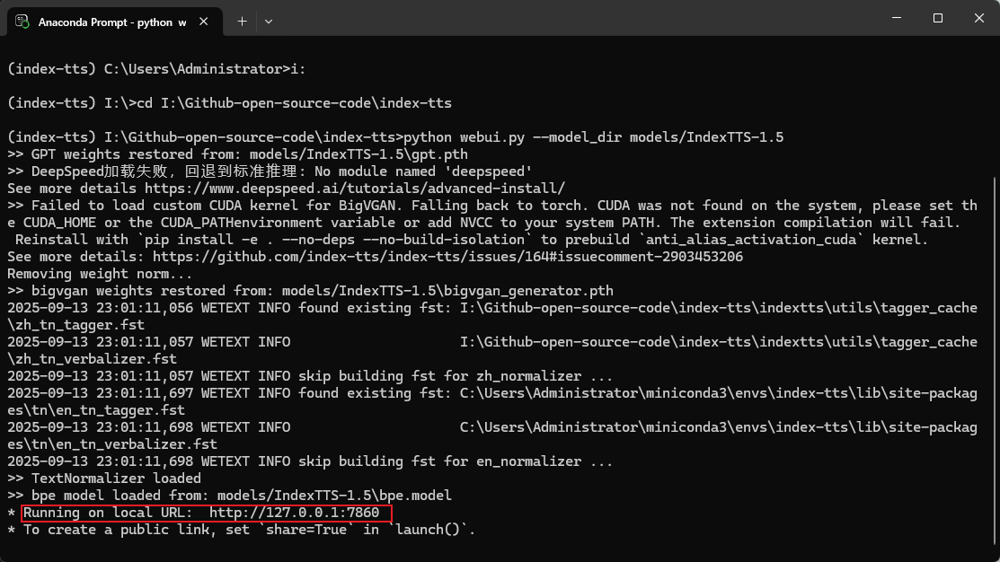
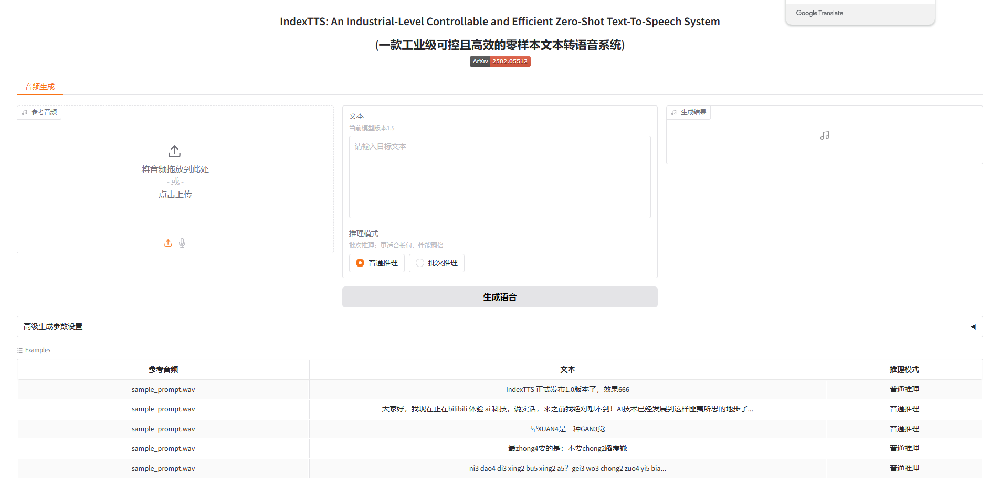
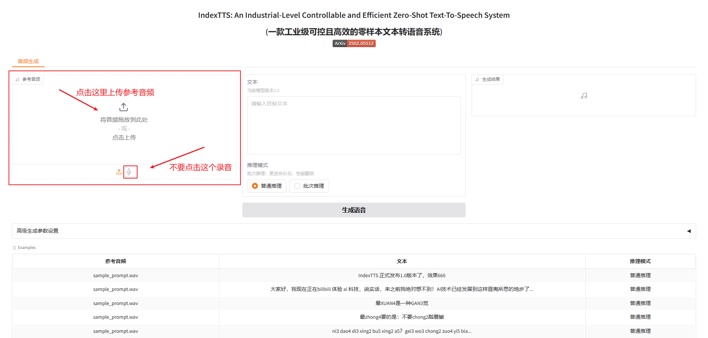
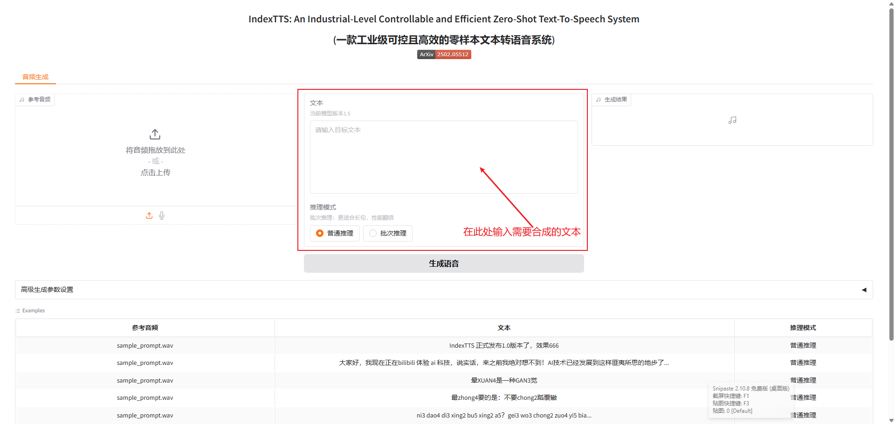
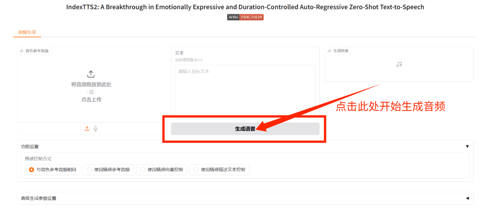
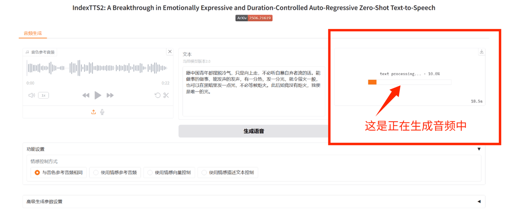
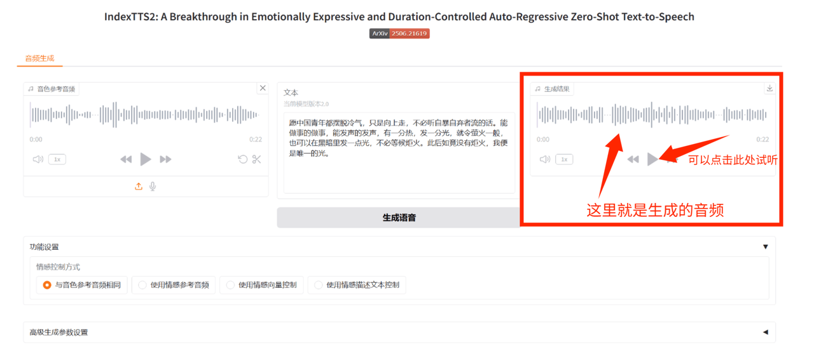

# An Industrial-Level Controllable and Efficient Zero-Shot Text-To-Speech System Topics

## 一、启动Web操作界面

每次关闭 Anaconda Prompt 后，需要重新打开之前配置好的项目环境，然后进入到要执行的Web代码的路径下。
主要依照如下步骤执行： 
🔹 点击 Anaconda Prompt 进入"控制台" 
🔹 输入指令 `conda env list`，查看当前 conda 已创建的环境列表，输出中带 `*` 的那行表示当前已激活的环境 
🔹 输入指令 `conda activate <环境名>`，激活项目环境 
🔹 切换盘符，然后进入到项目代码路径中 
🔹 输入指令 `python webui.py --model_dir models/IndexTTS-1.5` 开启Web页面

 

## 二、生成音频

1. 如图，找到【参考音频】选项卡
  - 点击后上传参考音频
  - 您需在使用前准备好您的参考音频
  
2. 参考音频：
   1. 上传的音频必须为 wav 格式
   2. 参考音频的质量至关重要！请选择高质量音频。
   3. 音频时长建议在 10-30 秒 之间，过长或过短都可能影响效果。

3. 请不要在【参考音频】选项卡中录音

## 三、输入需要合成的文本

1. 如图，找到【文本】选项卡
2. 请在【文本】选项卡中 输入你需要合成的文本
   1. 文本过长请切分后多次合成
   2. 长文本直接合成容易出现效果下降或“胡言乱语”的情况
   3. 长文本合成消耗的时间也会更长

## 四、生成音频

1. 如图，找到【生成语音】选项卡
   1. 点击后开始生成音频
2. 等待生成完成。
   1. 这个过程会消耗一些时间，具体取决于你的文本长度和电脑性能。
3. 请耐心等待

**4.1 这是正在生成音频中**
  - 请耐心等待

**4.2 生成完成**
- 可点击【播放按键】试听音频

